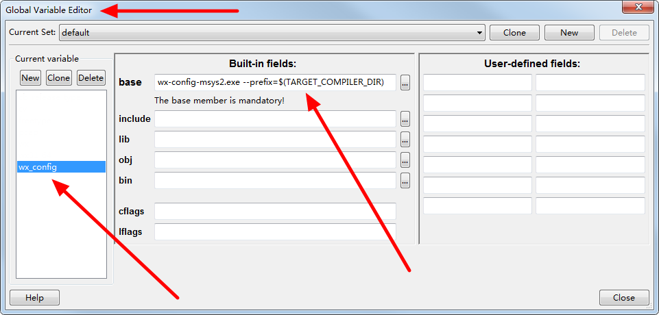
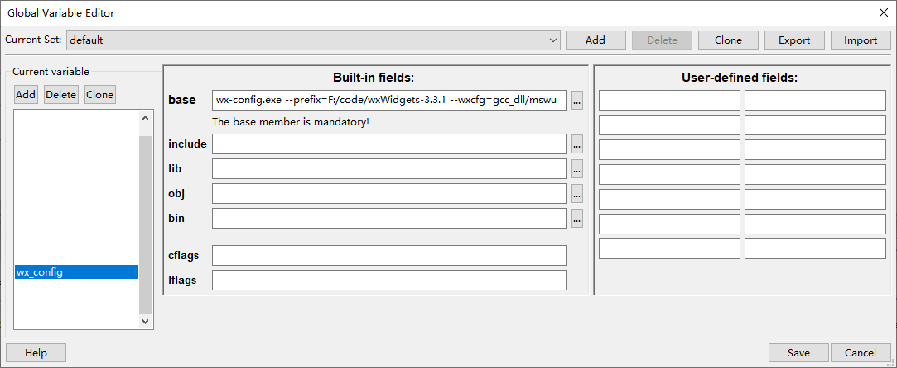

# cb_projects_for_wxWidgets news

2025-11-11: I have updated the samples code to the wxWidgets 3.3.1.

2022-09-17: This git repo is a fork from [stahta01/cb_projects_for_wxWidgets](https://github.com/stahta01/cb_projects_for_wxWidgets).
It currently supports building wx samples(wxWidgets 3.x) by using msys2's prebuild wx library or you selfbuild wxWidgets library under Code::Blocks IDE.

# Building samples projects against the wxWidgets library pre-build in the MSYS2 environment

A tool named `wx-config-msys2.exe` is needed(you can put it in PATH environment) to generate compiler option and linker option.
See [wx-config-msys2](https://github.com/eranif/wx-config-msys2) for more details.

For discussion, you can see here in Code::Blocks' forum thread: [codeblocks cbp projects for wx samples](https://forums.codeblocks.org/index.php/topic,25105.0.html).

You have to set a global variable named "WX_CONFIG" in the Code::Blocks' setting "Global Variable Editor" dialog, see below:



The value of the "WX_CONFIG" could be something like below:

If you are using the pre-build wxWidgets library from msys2 project, such as you install the library by the command line `pacman -S mingw-w64-x86_64-wxwidgets3.2-msw`.

Note that the MinGW64 platform has the latest wx 3.2.x version,
see [Package: mingw-w64-x86_64-wxwidgets3.2-msw - MSYS2 Packages](https://packages.msys2.org/package/mingw-w64-x86_64-wxwidgets3.2-msw?repo=mingw64),
while the UCRT64 platform has the latst wx 3.3.x version,
see [Base Package: mingw-w64-wxwidgets3.3 - MSYS2 Packages](https://packages.msys2.org/base/mingw-w64-wxwidgets3.3)

```
wx-config-msys2.exe --prefix=$(TARGET_COMPILER_DIR)
```

# Building samples projects against the wxWidgets library build yourself

If you are using the wxWidgets library build yourself, such as the build command is like:

```
mingw32-make -j4 -f makefile.gcc SHARED=1 MONOLITHIC=1 BUILD=release UNICODE=1
```

then the `WX_CONFIG` could be defined as:

```
wx-config.exe --prefix=F:/code/wxWidgets-3.3.1 --wxcfg=gcc_dll/mswu
```

See image show like below:



Note that the `wx-config.exe` can be built from the [wx-config-msys2](https://github.com/eranif/wx-config-msys2) project too.

If you have debug option enabled, such as

```
mingw32-make -j4 -f makefile.gcc SHARED=1 MONOLITHIC=1 BUILD=debug UNICODE=1
```

you may need to define the `WX_CONFIG` like below:

```
wx-config.exe --prefix=E:/code/wxWidgets-3.3.1 --wxcfg=gcc_dll/mswud --debug
```

# stahta01's old readme content

Code::Blocks projects for building wxWidgets sample code

The file wx-config.exe needs to be in the exe search path.
To build it compile the CB project in folder wx-config-win.

The way these CB Projects are setup requires
that these windows env. variables be set
WXWIN to the base folder of the wxWidgets source code.
 This base folder should contain an include folder under it.
WXCFG to the relative path that contains the build.cfg
 Example: gcc_dll\mswu
