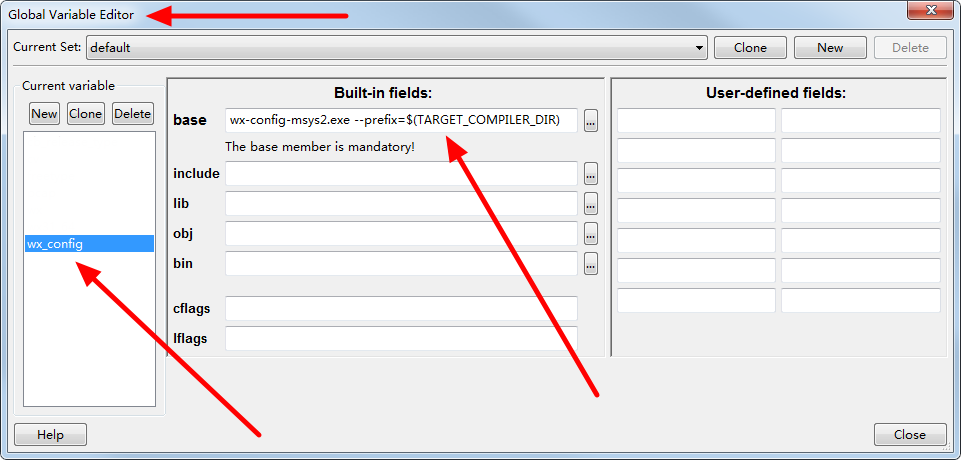

cb_projects_for_wxWidgets
=========================

2022-09-17 added by asmwarrior:

This git repo is a fork from [stahta01/cb_projects_for_wxWidgets](https://github.com/stahta01/cb_projects_for_wxWidgets)
It currently support building wx samples(wxWidgets 3.2.1) by using msys2's prebuild wx library (wxWidgets 3.2) under Code::Blocks IDE.

A tool named `wx-config-msys2.exe` is needed(you can put it in PATH environment) to generate compiler option and linker option, see here for more details.
[wx-config-msys2](https://github.com/eranif/wx-config-msys2).

For discussion, you can see here: [codeblocks cbp projects for wx samples](https://forums.codeblocks.org/index.php/topic,25105.0.html).

You have to set a global variable named "WX_CONFIG" in the Code::Blocks' setting "Global Variable Editor" dialog, see below:

The value of the "WX_CONFIG" could be something like below:

If you are using the pre-build wxWidgets library from msys2 project, such as you install the library by the command line `pacman -S mingw-w64-x86_64-wxwidgets3.2-msw`. (See: [Package: mingw-w64-x86_64-wxwidgets3.2-msw - MSYS2 Packages](https://packages.msys2.org/package/mingw-w64-x86_64-wxwidgets3.2-msw?repo=mingw64))
~~~~
wx-config-msys2.exe --prefix=$(TARGET_COMPILER_DIR)
~~~~
If you are using the wxWidgets library build yourself, such as the build command is like: `mingw32-make -j4 -f makefile.gcc SHARED=1 MONOLITHIC=1 BUILD=release UNICODE=1`, then the `WX_CONFIG` could be defined as:
~~~~
wx-config.exe --prefix=F:/code/wxWidgets-3.2.4 --wxcfg=gcc_dll/mswu
~~~~
If you have debug option enabled, such as `mingw32-make -j4 -f makefile.gcc SHARED=1 MONOLITHIC=1 BUILD=debug UNICODE=1`, you may need to define the `WX_CONFIG` like below:
~~~~
wx-config.exe --prefix=E:/code/wxWidgets-3.2.4 --wxcfg=gcc_dll/mswud --debug
~~~~

stahta01's old readme content
==========================
Code::Blocks projects for building wxWidgets sample code

The file wx-config.exe needs to be in the exe search path.
To build it compile the CB project in folder wx-config-win.

The way these CB Projects are setup requires
that these windows env. variables be set
WXWIN to the base folder of the wxWidgets source code.
 This base folder should contain an include folder under it.
WXCFG to the relative path that contains the build.cfg
 Example: gcc_dll\mswu
